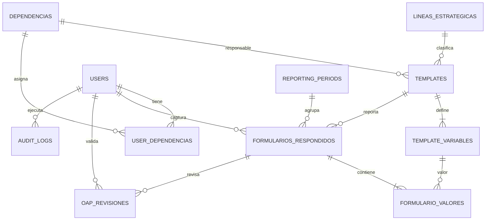
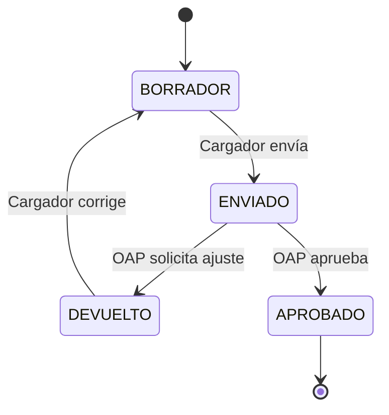

# Arquitectura funcional

## Separación de responsabilidades

- **Template anual:** información metodológica estable: código, línea, dependencia, objetivo, definición, fórmula, unidad, meta, fuente y variables.
- **Periodo:** ventana mensual controlada por administración.
- **Captura:** valores del periodo y textos cualitativos. La fórmula y acumulados los calcula el servidor.
- **Revisión OAP:** comentario independiente, decisión y estado de aplicación de la recomendación.
- **Publicación:** el visor y los pipelines consumen únicamente reportes `APROBADO`.
- **Auditoría:** toda creación, edición, envío, devolución, aprobación e inicio de sesión genera un evento.

## Modelo relacional



## Estados

### Template

`BORRADOR → ACTIVO → INACTIVO`

- Un template solo puede activarse cuando tiene al menos una variable.
- Los códigos reutilizados se conservan mediante `version` por vigencia.
- `estado_indicador` conserva la clasificación del maestro: Activo, Modificado, Nuevo o Inactivo.

### Reporte mensual



## Variables y acumulados

Cada variable declara un modo:

- `SUM`: suma los valores de periodos anteriores aprobados y el valor actual.
- `LATEST`: conserva el último valor; se usa para metas, universos, denominadores, porcentajes y variables ya acumuladas.

La expresión de fórmula solo admite `V1` a `V7`, números y operaciones aritméticas. Se evalúa mediante un árbol sintáctico seguro; no usa `eval`.

## Revisión OAP

Una revisión contiene:

- comentario;
- decisión: `COMENTARIO`, `APROBAR` o `DEVOLVER`;
- aplicación de la recomendación: `PENDIENTE`, `APLICADA` o `NO_APLICADA`;
- usuario y fecha, generados por el servidor.

La OAP no modifica los valores capturados. Si encuentra una inconsistencia, devuelve el reporte y el cargador genera la corrección, preservando la trazabilidad.

## Relación con el pipeline PAI

El pipeline Python proporcionado agrega resultados por producto, línea, trimestre y año. En la arquitectura propuesta debe leer:

1. `templates` activos de la vigencia;
2. `formularios_respondidos` con estado `APROBADO`;
3. `formulario_valores` para valores de periodo y acumulados;
4. `reporting_periods` para agrupar por mes o trimestre.

Cada ejecución debe registrarse en `pipeline_runs`; cualquier salida pública se genera desde datos aprobados y no desde borradores.

## Siguiente integración del frontend

El frontend actual usa `src/data/indicadores.json`. La integración consiste en sustituir esa fuente por:

```text
GET /api/public/indicators?year=2026
```

Las pantallas adicionales deben consumir:

- **Mis indicadores:** `/api/capture/assignments`.
- **Formulario mensual:** `PUT /api/capture/reports/{template}/{year}/{month}`.
- **Bandeja OAP:** `/api/oap/reports`.
- **Administración de templates:** `/api/templates`.
- **Usuarios:** `/api/admin/users`.
